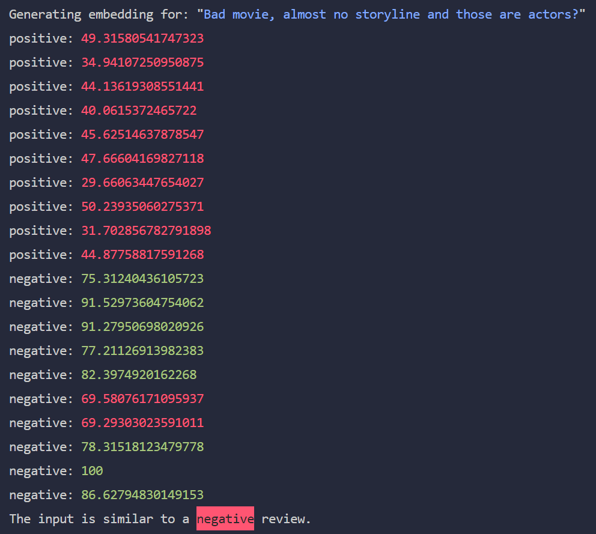

# Sentiment Analysis with Rust

## Introduction

This project is a simple sentiment analysis tool that uses 'dot product' similarity to calculate the similarity between an input text and 6 basic emotions. To determine the sentiment of the input text.

- sadness
- happiness
- fear
- anger
- suprise
- disgust

## Usage

To run the sentiment analysis, use the following command:

```bash
# cargo run <input text>
cargo run "This is the best day ever!"
```

This will calulcate the similarity between the input text and the 6 basic emotions. This similarity is normalized based on the maximum similarity found in the 6 basic emotions to give a percentage between 0 and 100.

This will show a result similar to the following:



The current implementation uses a **threshold of 70.0**. This threshold can be adjusted in the `main.rs` file.

## Preparation

To re-generate the embeddings for the 6 basic emotions, use the following command:

```bash
cargo run generate
```

This will generate the embeddings for the 6 basic emotions and save them in `data/embedded-emotions.json`.
