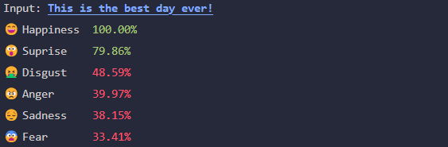

# Sentiment Analysis with Rust

## Introduction

This project is a simple sentiment analysis tool that uses 'dot product' similarity to calculate the similarity between an input review and a set of positive and negative reviews. To determine the sentiment of the input review (positive or negative).

## Preparation

The positive and negative reviews can be found in the `/data` directory. These reviews are generated by ChatGPT and are not real reviews.

- `positive-movie-reviews.json` contains 10 positive reviews
- `negative-movie-reviews.json` contains 10 negative reviews

When running the 'generate' command, the embeddings for the reviews will be generated and saved in the `/data` directory.

- `positive-movie-reviews-embeddings.json`
- `negative-movie-reviews-embeddings.json`

To generate the embeddings, use the following command:

```bash
# this will generate the embeddings for the positive reviews
cargo run generate positive
# this will generate the embeddings for the negative reviews
cargo run generate negative
```

## Usage

To run the sentiment analysis, use the following command:

```bash
# cargo run <input review text>
cargo run "Bad movie, almost no storyline and those are actors?"
```

This will calulcate the similarity between the input review and the positive and negative reviews. This similarity is normalized based on the maximum similarity found in the positive and negative reviews to give a score between 0 and 100.

This will show a result similar to the following:



The current implementation uses a **threshold of 70.0** to determine if the input review is positive or negative. This threshold can be adjusted in the `main.rs` file.
